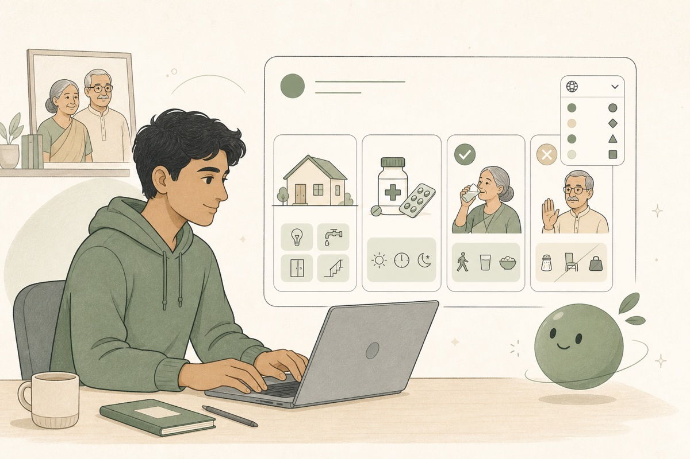
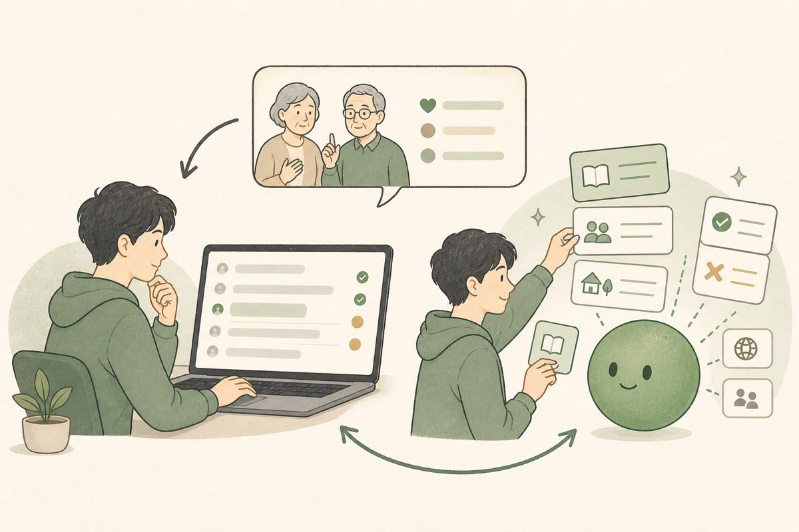
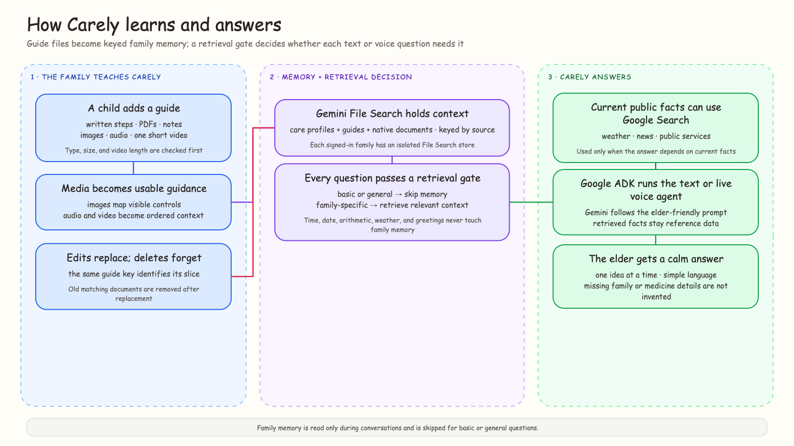

<p align="center">
  
</p>

<h1 align="center">Carely</h1>

<p align="center">
  A family-grounded voice agent that older adults can call from any phone, while relatives manage trusted guides, reminders, contacts, and conversation history from a web dashboard.
</p>

<p align="center">
  <a href="https://carely-web-58893316002.us-central1.run.app/">Live demo</a>
  ·
  <a href="https://carely-web-58893316002.us-central1.run.app/pitch">Demo introduction</a>
  ·
  <a href="https://carely-api-58893316002.us-central1.run.app/health">API health</a>
</p>

<!-- README-HACK:NEEDS-OWNER key="demo-video" instruction="Add the final public demo video URL beside the live-demo links." -->

## The idea

A basic phone can make a call, but it cannot open an app, search the web, or reach an AI assistant. That becomes a real problem when an older parent needs help remembering medicine, following household instructions, or checking a family detail.

They may already have their child's number saved and still hesitate to call. Small questions can feel like interruptions. Carely starts with the interface they already trust: a phone call.

## How Carely works

1. **A family member prepares Carely.** They add care recipients, trusted contacts, daily reminders, and household guides from the dashboard.
2. **The older adult calls.** Carely identifies the saved caller, listens through a normal phone connection, and answers in short, clear language.
3. **The family improves the support.** Conversation transcripts, summaries, actions, sources, and quality review show where better guidance is needed.

<table>
  <tr>
    <th>1. Configure</th>
    <th>2. Call</th>
    <th>3. Review</th>
  </tr>
  <tr>
    <td></td>
    <td></td>
    <td></td>
  </tr>
</table>

### What works today

- Text and live browser voice use the same Google ADK agent and grounded tools.
- Family guides can include written instructions, PDFs, documents, images, audio, and one short video.
- Each signed-in family receives an isolated Gemini File Search store for its profiles and guides.
- A retrieval gate skips private family memory for general questions and searches it only when personal context is relevant.
- Google Search can support current public information. Nearby Google Places assistance is available behind an explicit opt-in flag.
- Callers can create daily reminders only after confirming the person, time, and message.
- The dashboard stores owner-scoped contacts, care recipients, guides, reminders, transcripts, sources, actions, summaries, and conversation reviews.
- The inbound phone path validates provider signatures, bridges phone audio to Gemini Live, and saves completed conversations.

## Personal context without guessing

Carely does not send every question into family memory. Greetings, arithmetic, time, weather, and other general questions skip it. Questions about medicines, routines, preferences, appliances, relationships, or saved instructions can retrieve the relevant family context instead.

Guide edits replace their matching memory, and guide deletion removes it. The agent treats uploaded files and retrieved results as untrusted reference data and does not invent missing family or medication details.



## Architecture

Carely is a Bun and TypeScript monorepo with two applications:

- **Next.js web app:** Google sign-in, the family dashboard, browser text and voice testing, SQLite-backed family records, and the reminder worker.
- **Hono API:** Google ADK orchestration, Gemini text and live voice sessions, Gemini File Search ingestion and retrieval, Google Search, optional Places lookup, conversation review, and telephony endpoints.
- **Phone bridge:** Signed inbound requests create a caller-bound session. Bidirectional audio is converted between telephone audio and the PCM format used by Gemini Live.
- **Conversation record:** Transcripts, retrieved source names, and confirmed reminder actions are reviewed and returned to the dashboard under the authenticated family owner.

The public demo runs as separate `carely-web` and `carely-api` services on Google Cloud Run. The API is configured for Vertex AI in project `carely-505510`.

## Built with

- TypeScript and Bun 1.3.14
- Next.js 16 and React 19
- Hono
- Google ADK
- Gemini 3.5 Flash Lite and Gemini Live
- Gemini File Search and Google Search
- Twilio Voice and Media Streams
- SQLite
- Google Cloud Build and Cloud Run

## Reproduce and run locally

The default local setup runs the complete web dashboard, text agent, browser voice path, guide ingestion, reminders, and conversation review. Real carrier calls and nearby-place answers are optional and remain disabled until their provider credentials are configured.

### 1. Prerequisites

- [Bun 1.3.14](https://bun.sh/) or the version declared in `package.json`
- A Gemini API key with access to Gemini 3.5 Flash Lite and File Search
- A Google OAuth web client for dashboard sign-in
- `ffprobe` only when testing guide-video uploads (`brew install ffmpeg` on macOS)

### 2. Clone and install

```bash
git clone https://github.com/vimzh/carely.git
cd carely
bun install --frozen-lockfile
```

### 3. Create the local environment files

```bash
cp apps/web/.env.example apps/web/.env.local
cp apps/api/.env.example apps/api/.env
```

Generate an Auth.js secret and a separate internal agent secret:

```bash
openssl rand -base64 32
openssl rand -hex 32
```

Put the first value in `AUTH_SECRET`. Put the second value in `CARELY_AGENT_SECRET` in **both** environment files; the two services reject internal agent actions when those values do not match.

Configure the required web values in `apps/web/.env.local`:

```dotenv
AUTH_GOOGLE_ID=<google-oauth-client-id>
AUTH_GOOGLE_SECRET=<google-oauth-client-secret>
AUTH_SECRET=<output-of-openssl-rand-base64>
CARELY_AGENT_SECRET=<shared-agent-secret>

NEXT_PUBLIC_CARELY_PLACES_ENABLED=false
CARELY_REMINDER_SCHEDULER_ENABLED=false
```

Configure the required API values in `apps/api/.env`:

```dotenv
GEMINI_API_KEY=<gemini-api-key>
CARELY_AGENT_SECRET=<same-shared-agent-secret>
CARELY_WEB_ORIGIN=http://localhost:3004
CARELY_API_DATABASE_PATH=./data/carely-api.sqlite

CARELY_PLACES_ENABLED=false
```

In the Google OAuth client, add this authorized redirect URI:

```text
http://localhost:3004/api/auth/callback/google
```

Do not commit either environment file. Both are already ignored by Git.

### 4. Start both services

From the repository root:

```bash
bun run dev
```

The workspace command starts the web and API processes together:

| Surface | Local URL |
| --- | --- |
| Web app | http://localhost:3004 |
| Demo introduction | http://localhost:3004/pitch |
| API health | http://localhost:3001/health |

Verify the backend independently:

```bash
curl http://localhost:3001/health
```

Expected response:

```json
{"status":"ok"}
```

Sign in at `http://localhost:3004`, add a care recipient, then use **Try Carely** to verify a Gemini response. Adding a written or image guide also verifies the family-scoped ingestion and retrieval path.

### 5. Run the repository checks

```bash
bun run --filter '*' test
bun run lint
bun run typecheck
bun run build
```

These commands exercise both workspaces. They do not place live carrier calls because the reminder scheduler and telephony providers remain disabled by default.

### Optional: nearby places

Nearby answers require separate browser- and server-restricted Google Maps keys:

```dotenv
# apps/web/.env.local
NEXT_PUBLIC_CARELY_PLACES_ENABLED=true
NEXT_PUBLIC_GOOGLE_MAPS_API_KEY=<browser-restricted-key>
NEXT_PUBLIC_GOOGLE_MAPS_MAP_ID=<map-id>

# apps/api/.env
CARELY_PLACES_ENABLED=true
GOOGLE_MAPS_API_KEY=<server-restricted-key>
```

Enable Maps JavaScript API for the browser key and Places API (New) for the server key. Never expose the server key through a `NEXT_PUBLIC_` variable.

### Optional: real phone calls

Real inbound or reminder calls require a Twilio voice number, provider credentials, and public HTTPS/WSS endpoints. Localhost can exercise the dashboard and agent but cannot receive an external voice webhook without a secure public tunnel or deployment. See [apps/api/README.md](apps/api/README.md) for the inbound webhook path and required provider variables.

## Google Cloud deployment

The repository contains Dockerfiles for both applications and a Cloud Build configuration. Build and push both images from the repository root:

```bash
gcloud builds submit --project "$GOOGLE_CLOUD_PROJECT" --config cloudbuild.yaml .
```

Deploy `carely-api` first, then configure `carely-web` with the API URL and the same `CARELY_AGENT_SECRET`. The current public deployment is available at:

- Web: https://carely-web-58893316002.us-central1.run.app/
- API health: https://carely-api-58893316002.us-central1.run.app/health

## Prototype boundaries

The public Cloud Run deployment is suitable for the hackathon demonstration, but SQLite databases, uploaded files, voice-session admission, and reminder coordination remain instance-local. Keep each service at one instance for the demo. Before horizontal scaling, move those responsibilities to shared durable storage and coordination services.

Real carrier calls still depend on external provider credentials and number configuration. Provider-dependent behavior fails visibly rather than being presented as successful when those resources are unavailable.

## What's next

- Move database, upload, voice-session, and scheduler state to durable shared Google Cloud services.
- Expand multilingual and mixed-language conversations, including Hindi and Hinglish.
- Add stronger operational observability for retrieval, latency, tool execution, and provider failures.
- Continue accessibility testing with older adults and caregivers.

## Attribution

P22 Mackinac W01 Book is sourced from [OnlineWebFonts](https://www.onlinewebfonts.com/fonts) under the CC BY 4.0 terms stated by the supplied stylesheet.
