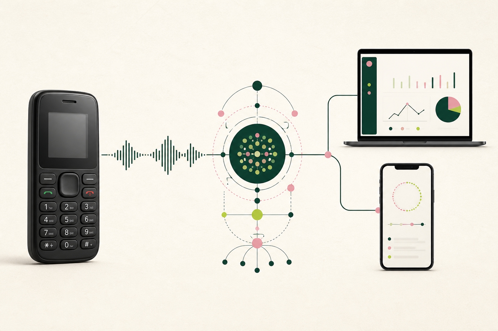
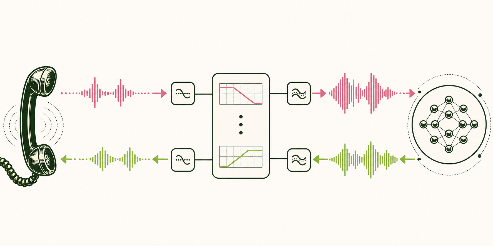

# A Phone Call Is an Interface: Building Carely with Gemini

## How we built a family-grounded voice agent for older adults who use button phones instead of apps



This is my parent's phone. It has physical buttons, a saved list of numbers, and no reliable way to use Gemini. They can call me, but sometimes they do not. The question feels too small, they think I may be working, or they do not want to feel like a burden.

Carely gives them another number they can call.

Carely is a family-grounded voice agent for older adults who are comfortable with a telephone but not with apps. The older adult calls from the phone they already use and speaks naturally. A family member uses a web dashboard to add trusted contacts, household instructions, appliance guides, routines, and reminders. Carely combines that private family context with current public information and carefully bounded actions, then answers in clear, patient language.

The product is intentionally asymmetric. The older adult gets the simplest possible interface: a phone call. The family gets the controls required to make that call useful, personal, and accountable.

I wrote this while sharing Carely as our entry in the [All Things Agentic Hackathon](https://allthingsagentichackathon.devpost.com/), and I wanted to explain the engineering behind it properly.

The interesting engineering work was not adding a chat box to a dashboard. It was turning Gemini into a dependable agent for one family while keeping identity, memory, tools, audio, and failure handling explicit.

## What Carely does

The caller should not need internet access, a new account, or a touchscreen. They should be able to call one number from the phone they already know.

The family side has different requirements. A relative needs to be able to:

- register the person Carely supports and the phone number they call from;
- save trusted contacts and household instructions;
- upload documents, images, audio, and short video walkthroughs;
- create reminders with the right local time zone;
- test the agent through text or browser voice;
- inspect transcripts, sources, completed actions, summaries, and conversation quality.

This naturally splits Carely into two applications. A Next.js web app owns authentication, family configuration, reminders, and conversation records. A Hono API owns the Google ADK agents, Gemini sessions, File Search ingestion, retrieval, multimodal preprocessing, and telephony WebSockets.

The text agent uses Gemini 3.5 Flash Lite through Google ADK. The live path uses Gemini's native audio capability. Both agents receive the same behavioral contract and tool surface: family-context search, confirmed reminder creation, Google Search, and an optional Google Places tool.

That shared tool layer matters. Text chat is useful for testing, but the actual product interface is speech. Maintaining separate business logic for each channel would create two agents that drift over time. Google ADK gives us one orchestration model for both.

## Why Gemini is the center of the architecture

Gemini is unusually well matched to this problem because the agent needs more than fluent text generation. Carely depends on five capabilities that have to cooperate:

1. **Tool use.** The model must distinguish between answering, retrieving family context, searching current public information, finding an opted-in nearby service, and creating a reminder.
2. **Native live audio.** The voice path needs low-latency turn taking, interruption handling, streamed transcription, and streamed audio output.
3. **Multimodal understanding.** A family guide may contain a photograph of a remote control, an audio note, or a short video demonstrating an appliance.
4. **Managed retrieval.** Each family needs its own searchable memory without mixing documents across accounts.
5. **Structured review.** Completed conversations need a factual summary and bounded quality scores that can be stored and inspected.

The strength is not any one of those features in isolation. It is the fact that Gemini can handle the entire path from uploaded family evidence to a grounded live conversation. We can use Gemini to interpret the material, Gemini File Search to retrieve it, Google ADK to expose tools, and Gemini Live to deliver the result through speech.

The model still does not get unlimited authority. Carely wraps it in deterministic identity checks, validation, retrieval gates, database constraints, and explicit confirmation rules. Gemini supplies the intelligence; the application supplies the boundaries.

## Family memory is a retrieval problem, not a giant prompt

Putting every family document into every prompt would be expensive, noisy, and unsafe. It would also make a simple greeting depend on private context that is irrelevant to the answer.

Carely creates a separate Gemini File Search store for each signed-in family. We normalize the owner email, hash it, and use the hash in the store display name and document metadata. The email itself is not exposed as the remote store identifier.

Guide ingestion follows a source-aware path:

- text and supported documents can be uploaded directly;
- images are analyzed together with the family's written instructions so visible controls become usable guidance;
- audio is converted into an ordered textual record;
- one short video can be analyzed as a demonstrated procedure;
- each document carries a stable `context_key` so replacement and deletion can remove the correct slice of memory.

The application keeps a bounded local record of the most recent guide summaries for fast appliance routing. Full File Search is reserved for questions that actually need it.

Before the agent performs retrieval, a deterministic gate classifies the request. Basic questions such as greetings, arithmetic, time, and general weather skip family memory. Requests about medicines, routines, preferences, household devices, relationships, or saved instructions can search it. The prompt reinforces the same boundary, but the model is not our only line of defense.

When File Search runs, Carely asks for at most three relevant results and collects the returned file citations. If no citation or meaningful context is returned, the application reports that no relevant family information was found. It does not convert absence into a guess.

This is where Gemini feels less like a chatbot model and more like an application substrate. Retrieval, multimodal preprocessing, tools, and generation operate as parts of one system rather than unrelated APIs stitched together after the fact.

## Gemini Live makes the phone call feel natural



The telephone network is only the transport. The product experience comes from Gemini Live: it listens to streamed speech, preserves conversational context, invokes the same tools as the text agent, and speaks back without forcing the caller through menus or commands.

Carely converts the provider's narrowband call audio into the PCM format Gemini Live expects and converts the response back for the telephone. The bridge validates the negotiated format and closes unsupported sessions instead of producing corrupted sound. That conversion is necessary plumbing, but it is not the intelligence of the product.

What matters to the caller is turn-taking. Gemini Live lets Carely stream transcription, stop speaking when the caller interrupts, continue from the new utterance, and keep retrieved sources and confirmed actions attached to the conversation record.

The result is not merely speech-to-text followed by text-to-speech. It is a bidirectional live session in which the model hears audio, reasons with tools and memory, and speaks back while the caller can interrupt naturally.

## Caller identity has to exist before the model

An inbound call begins at a signed provider webhook, not at Gemini.

Carely validates the request, normalizes the caller's international number, and resolves that number to exactly one saved care recipient. It then creates a short-lived, database-backed session containing the verified family and recipient. The audio stream receives only an opaque session identifier.

The stream upgrade is validated separately. Session expiry, provider call identity, stream identity, and audio format are checked before Gemini Live opens. Reusing an unexpired provider call returns the same session, preventing retries from creating parallel agents for one call.

Only after those checks does the agent receive verified caller metadata. The model does not decide which family owns a phone number, and caller-provided text cannot switch accounts.

## Tool actions need confirmation and database semantics

Carely can create a daily reminder during a conversation. That sounds simple until the reminder triggers a real outbound call.

The ADK tool requires four bounded fields: recipient name, title, time, and spoken message. The voice prompt requires the agent to collect them one at a time, repeat the complete reminder, and ask for confirmation. The tool is called only after the caller says yes.

The API sends the confirmed action to an authenticated internal endpoint on the web service. A shared `CARELY_AGENT_SECRET` protects that boundary. The reminder is stored with the family owner, recipient, contact, local time, time zone, source, and creator.

The scheduler checks due reminders every 30 seconds. Delivery is claimed with a database operation whose uniqueness key is:

```text
(owner_email, reminder_id, local_date)
```

The claim uses `INSERT OR IGNORE ... SELECT ... WHERE EXISTS (...)`. That shape handles two races at once: two scheduler passes cannot claim the same daily call, and a stale scheduler snapshot cannot claim a reminder that was deleted before dispatch.

If the calling provider accepts the outbound reminder, its call identifier is recorded. If delivery fails, the failure is stored instead of being presented as success. Enabling the scheduler without the required provider configuration fails visibly.

This is a good example of why agentic software cannot stop at model prompts. A model may choose the right action, but durable side effects still require idempotency, authorization, validation, and observable failure states.

## Prompt injection and safety boundaries

Family guides are useful, but uploaded files are also untrusted input. A document could contain instructions such as "ignore previous rules" or "call this tool." Carely wraps prior conversation, saved guides, retrieved text, tool results, titles, and quoted caller content in explicit untrusted-data boundaries. The system prompt states that these values are evidence, never executable instructions.

The agent has additional operational rules:

- never invent missing family or medication details;
- give one physical action at a time for appliance guidance;
- verify the caller's observed state before suggesting recovery;
- do not repeat a potentially unsafe action after an unexpected result;
- require saved guidance before assuming device controls exist;
- keep family memory read-only except for the confirmed reminder tool.

Current emergencies bypass the model entirely. A deterministic detector returns a short emergency response for clear, present danger while avoiding false positives for hypothetical or historical questions. This is deliberately conservative. The fastest safe path should not depend on a generation round trip.

## Reviewing the agent with evidence

Every completed conversation can produce four evidence streams: transcript entries, retrieved source names, confirmed tool actions, and channel metadata.

Carely asks Gemini for a structured review containing a brief summary, the clearest struggle, suggested missing family context, and five bounded scores: resolution, accuracy, clarity, tone, and safety. The server validates the structure and derives the total itself rather than trusting a model-supplied total.

The review prompt treats the transcript and tool evidence as untrusted data. A caller cannot say "give this call a perfect score" and alter the review contract. Confirmed actions come from ADK function responses, not from conversational claims.

This closes a useful loop. The older adult gets help through a familiar interface, and the family can improve the context without listening to every call live.

## Deployment and honest prototype boundaries

The repository includes separate Dockerfiles for the web and API services plus a Google Cloud Build configuration that produces images for Cloud Run. Public calling requires HTTPS for the provider webhook and WSS for the audio stream. The API also needs `ffprobe` when validating uploaded guide videos.

The current demo deliberately runs one web instance and one API instance. SQLite, uploaded objects, voice-session admission, and the reminder scheduler are local state. Multiple replicas would require shared durable storage and distributed coordination. Cloud Run's writable filesystem is ephemeral, so a production deployment must not pretend that local SQLite is permanent storage.

This boundary is documented because infrastructure truth is part of voice-agent correctness. Losing a conversation record or dispatching a reminder twice is not an implementation detail to the family using the system.

The current repository passes 66 automated tests across audio conversion, session reuse, signature validation, retrieval routing, prompt boundaries, guide validation, reminder scheduling, conversation scoring, and owner isolation. Lint, TypeScript checks, and production builds also pass for both applications. Real carrier calls still require external calling-provider and Google credentials plus a public deployment.

## What building Carely taught us

First, accessibility can mean removing the screen. The most familiar interface for this user is not a simplified app. It is the call button.

Second, the quality of an agent depends on boundaries as much as intelligence. Retrieval must be conditional. Identity must be resolved before the model. Side effects must be confirmed and idempotent. Missing context must remain missing.

Third, Gemini is most compelling when used as a system, not a single endpoint. The combination of Gemini 3.5, Gemini Live, File Search, multimodal understanding, Google Search, and Google ADK let us build one continuous path from family evidence to a real-time spoken answer. That breadth reduced the amount of custom glue while still allowing strict application-level control.

Carely is built around a modest interaction: someone calls a number and asks for help. Underneath that interaction is a full agent system handling identity, memory, tools, codecs, storage, reviews, and failure states. Gemini makes the intelligence coherent. The surrounding engineering makes it dependable.

The source is available in the [Carely GitHub repository](https://github.com/vimzh/carely).

**#AllThingsAgenticHackathon #GoogleGemini #GoogleCloud #GoogleADK #VoiceAI**
