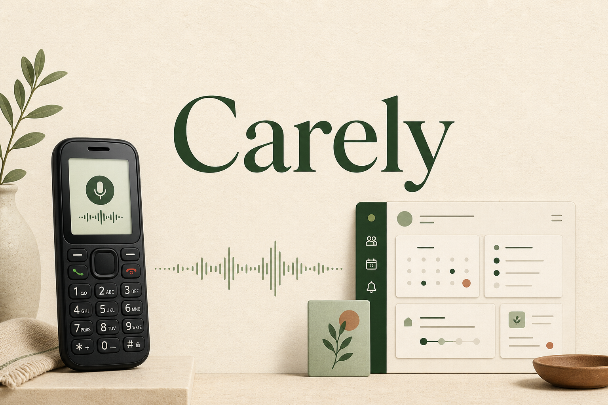

# Carely

## Elevator pitch

1. Carely turns any basic phone into a voice companion, helping older adults get trusted answers and reminders without internet, apps, or a smartphone.
2. One phone number gives older adults calm, personalized help while families manage trusted guides, contacts, reminders, and conversation history.
3. No smartphone. No internet. Just a familiar phone call to Carely for everyday questions, family guidance, and medication reminders.
4. Carely connects button phones to Gemini voice support, giving older adults independence and families confidence without changing familiar habits.
5. A voice companion for people who can call but cannot get online, powered by family context, Gemini, and one familiar phone number.

## Inspiration

A basic phone can make a call, but it cannot open an app, search the web, or reach an AI assistant. That gap matters when an older parent or grandparent needs help remembering medicine, following TV instructions, checking a family detail, or handling an everyday task.

The painful part is not only access. People often hesitate to call their children for small questions because they worry they are interrupting work or becoming a burden. Their family wants to help, but cannot always answer at the exact moment help is needed.

We built Carely around one observation: the phone call is already familiar. Older adults should not have to learn a smartphone interface before they can benefit from useful, personalized assistance. If they can dial a number and talk, that should be enough.

## What it does

Carely is a voice companion for older adults who use a basic mobile phone. A care recipient calls a configured Carely number and speaks naturally. Carely can answer everyday questions, use trusted family instructions, create reminders, and respond in short, clear language.

Family members configure the experience from a web dashboard. They can:

- Add care recipients and trusted contacts.
- Save reminders with the correct local time zone.
- Upload written guides, PDFs, notes, images, audio, and one short video.
- Try the same agent through text or browser voice before using the phone path.
- Review conversation transcripts, summaries, duration, and quality results.

Each family's care profile and guides are isolated in its own Gemini File Search context. A retrieval gate decides whether a question needs private family context. Basic or general questions skip that memory, while current public information can use Google Search. Carely is instructed not to invent missing family or medication details.

The repository also implements the inbound phone path through Twilio Media Streams and Gemini Live. A public deployment still requires a configured Twilio number, public HTTPS and WSS endpoints, and provider credentials.

## How we built it

Carely is a Bun and TypeScript monorepo with two applications:

- A Next.js and React web app for authentication, care recipients, contacts, guides, reminders, conversation logs, and browser-based agent testing.
- A Hono API that runs the agent, family-context ingestion, retrieval, voice streaming, telephony sessions, and conversation review.

Google ADK orchestrates the text and live voice agents. Gemini handles the conversation, Gemini File Search stores family-specific context, and Google Search is available when an answer depends on current public information. Nearby Google Places answers exist behind an explicit opt-in flag.

For phone calls, Carely validates Twilio webhook and WebSocket signatures, resolves the caller from the saved care-recipient number, and opens a bidirectional Media Stream. The API converts Twilio's G.711 mu-law audio into PCM for Gemini Live, then converts Gemini audio back into the format expected by the phone network.

SQLite stores owner-scoped contacts, reminders, guides, conversation logs, and voice-session admission state. Reminder delivery is claimed atomically so the scheduler cannot place the same daily call twice, including when a stale scheduler snapshot races with deletion.

The repository includes Dockerfiles and a Cloud Build configuration for two Google Cloud Run services. The current demo architecture intentionally uses one instance per service because SQLite, voice admission, and reminder scheduling are local state.

## Challenges we ran into

The first major challenge was connecting two very different audio systems. A normal phone call arrives as 8 kHz G.711 mu-law audio, while Gemini Live uses PCM at different sample rates. The bridge had to convert audio in both directions without hiding unsupported formats or silently returning bad sound.

The second challenge was deciding when personal memory should be used. Sending every question into a family's private context would be unnecessary and could produce confusing answers. We built a retrieval gate that skips memory for greetings, time, arithmetic, weather, and other general questions, then searches the isolated family store only when the question is family-specific.

Scheduling reminder calls introduced a different class of problem. Time zones, process restarts, duplicate delivery, and deletion races all matter when the action is a real phone call. We used database-backed delivery claims and explicit configuration checks so missing telephony credentials fail clearly instead of pretending a reminder was delivered.

Deployment also forced us to be honest about state. Cloud Run can host the hackathon build, but its writable filesystem is ephemeral. We documented the single-instance demo constraint instead of presenting local SQLite as production-grade distributed storage.

## Accomplishments that we're proud of

- We made a basic phone, not a smartphone app, the primary interface for the person receiving care.
- We built one agent experience across text, browser voice, and the signed Twilio phone bridge.
- We support multimodal family guides and keep every family's Gemini File Search store isolated.
- We added replace and delete behavior so updated family guidance does not leave stale matching context behind.
- We built durable reminder claims, conversation logs, summaries, quality review, and caller-specific session tracking.
- We kept provider-dependent features observable and fail-fast, including telephony, Gemini access, Google Places, uploads, and deployment storage.

## What we learned

Accessibility is not always a larger button or a simpler screen. Sometimes the right interface is no screen at all. Reusing a phone call removes the biggest adoption barrier for someone who already knows how to dial and talk.

We also learned that useful personalization depends as much on retrieval boundaries as it does on the model. The agent needs to know when family memory is relevant, when public search is appropriate, and when the honest answer is that information is missing.

Finally, voice systems make infrastructure details part of the product. Audio formats, WebSocket state, caller identity, signatures, scheduler ownership, and persistent storage directly affect whether the conversation feels dependable.

## What's next for Carely

The next step is a fully durable public deployment. That means moving both SQLite databases, voice-session admission, guide storage, and reminder coordination into shared persistent services before enabling multiple replicas.

We also want to complete production validation with a configured Twilio number and public HTTPS and WSS endpoints, including real carrier calls, callback handling, recovery from interrupted streams, and operational monitoring. Nearby-place assistance can then be validated with production-restricted Google Maps and Places keys while remaining opt-in for families that want it.

## Built with

- TypeScript
- Bun
- Next.js
- React
- Hono
- Google Gemini
- Google ADK
- Twilio
- SQLite
- Google Cloud Run

## Try it out

- GitHub repository: https://github.com/vimzh/carely
- Deployed URL: Not provided

## Project poster

